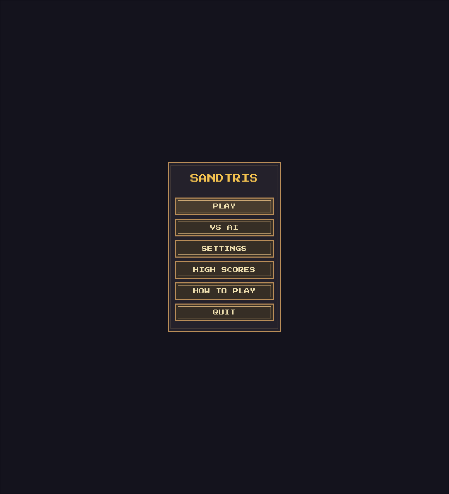
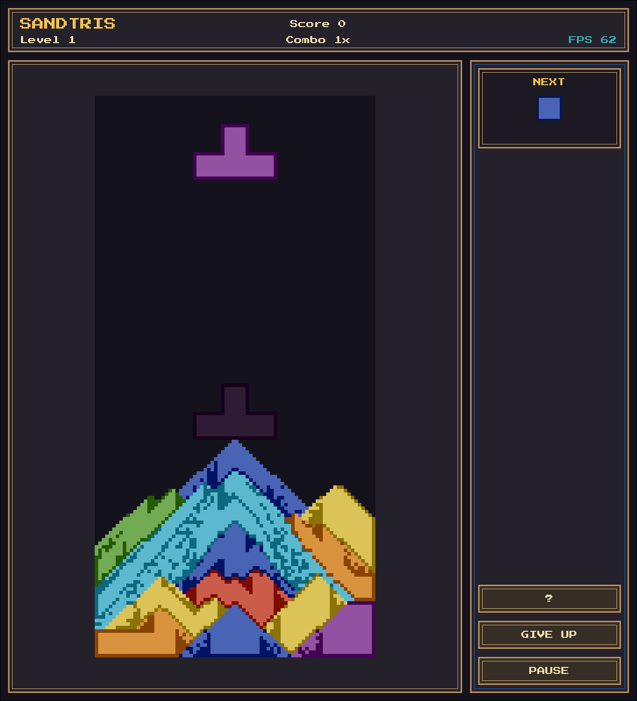
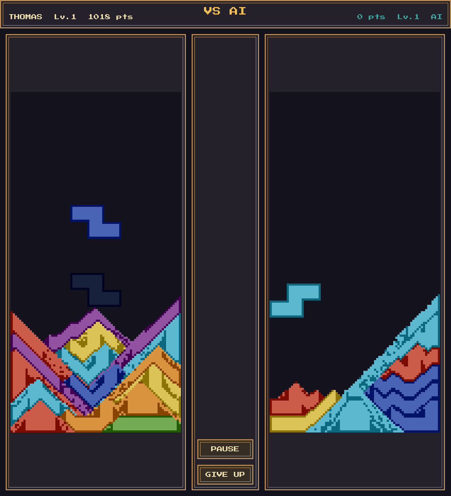

# Sandtris

[](https://Drewienko.github.io/sandtris/)

Tetris + falling sand physics. Pieces dissolve into sand particles on lock. Clear lines by connecting same-color sand from the left wall to the right wall.

## Screenshots

<p align="center">
  
  
  
</p>

## Play

- **Browser:** [Drewienko.github.io/sandtris](https://Drewienko.github.io/sandtris/)
- **Local:** `uv run sandtris`

## Controls

| Action | Keys |
|--------|------|
| Move | `←` `→` / `A` `D` |
| Rotate | `↑` / `W` |
| Soft drop | `↓` / `S` |
| Hard drop | `Space` / `Enter` |
| Pause | `Esc` / `P` |

## Install

Requires Python 3.12+ and `uv`.

```bash
git clone https://github.com/Drewienko/sandtris.git
cd sandtris
uv run sandtris
```

## AI

The VS AI mode is available in the desktop build. The DQN agent is a work in progress — it can survive for a while but line clears are still unreliable.

## Dev

```bash
uv run pytest          # tests
uv run ruff check .    # lint
uv run pygbag --build . # web build
```

Optional dependency groups: `ai-torch`, `ai-llm`, `api`, `web`.
